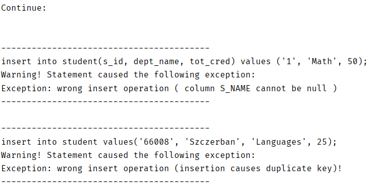

## 运行方式说明

### 服务端 `ThssDb`

* 运行`cn.edu.thssdb.server.ThssDB`主类以运行服务端程序。
* 可选的命令行参数如下：
    * `java [U]`: 设置隔离等级为`READ_UNCOMMITTED`
    * `java [C]`: 设置隔离等级为`READ_COMMITTED`
    * `java [S]`: 设置隔离等级为`SERIALIZATION`
* 默认命令行参数：
  
    * `java C`
    
      

### 客户端`IClient`

* 运行`cn.edu.thssdb.client.IClient`主类以运行客户端程序。
* 可选的命令行参数如下：
    * `java [-help]`： 显示帮助信息
    * `java [-h] <host>`: 设置 HOST IP
    * `java [-p] <port>`: 设置 port
* 默认命令行参数：
    * `java -h 127.0.0.1 -p 6667`

具体的可执行语句详见**用户文档**。

注：管理员可同时在多处登录，但非管理员只能在一处登录。

### 性能测试

如果助教提供的`Client.java`并无更改，可以使用我们提供的`Client.java`，与原版的区别仅在增加了`disconnect`之前的`dropDatabase`函数。增加该函数是因为由于数据库的恢复功能，重复执行`Client.java`时数据库创建、表创建、插入均会因为重复而提示错误。如果助教更改了`Client.java`，烦请在`disconnect`之前加入`drop database test`的语句，否则第二次及以后运行时插入的时间是不对的。

### 功能测试

为了便于展示，我们半自动地进行了功能的展示。这部分源代码位于`TestClient.java`。

运行该文件，并在其提示`continue`的时候按回车即可按照`insert`、`delete`、`update`、`show`、（之后为进阶要求）`alter`、`where子句多重and/or`、`多种join`、`多种select子项`、`聚集函数`、`order by`、`rollback&savepoint`的顺序验证正确性，示例如下图：

同样的原因，如果中途强行结束该程序，没能`drop database`，会导致下一次的创建数据库等操作提示错误。

并发的正确性验证难以使用自动化的方式进行，故没有相应代码。

此外，每个数据库的写前日志位于`data/<databaseName>/<databaseName>.log`文件中，可以以人工的方式验证`commit`、`checkpoint`时日志更改的正确性。