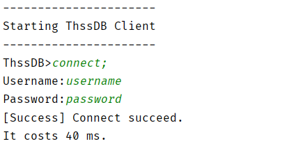
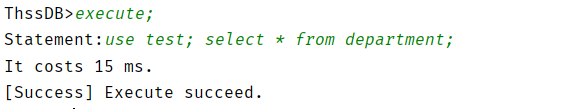
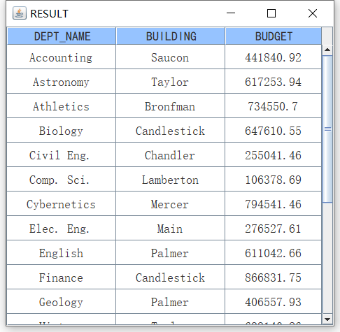
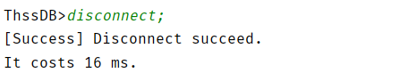

# 数据库大作业 用户文档

## **运行环境**

**操作系统：**Windows 10

**IDE:**  IDEA

**JRE版本：**1.8


## 程序启动

#### 服务端  `ThssDB`
* 运行`cn.edu.thssdb.server.ThssDB`主类以运行服务端程序。
* 可选的命令行参数如下：
    * `java [U]`: 设置隔离等级为`READ_UNCOMMITTED`
    * `java [C]`: 设置隔离等级为`READ_COMMITTED`
    * `java [S]`: 设置隔离等级为`SERIALIZATION`
* 默认命令行参数：
    * `java C`
#### 客户端  `IClient`
* 运行`cn.edu.thssdb.client.IClient`主类以运行客户端程序。
* 可选的命令行参数如下：
    * `java [-help]`： 显示帮助信息
    * `java [-h] <host>`: 设置 HOST IP
    * `java [-p] <port>`: 设置 port
* 默认命令行参数：
  
    * `java -h 127.0.0.1 -p 6667`
    
    

## 连接与断开（客户端）

### 用户连接
* 启动客户端后，输入如下命令，并输入用户名/密码以连接到服务端：
    * **ThssDB>**`connect;`
    * **Username:**`<username>`
    * **Password:**`<password>`
* 内建的管理权限用户名与密码：username/password

### 断开连接
* 在已于服务端连接的情况下，输入如下命令以断开连接：
  
    * **ThssDB>**`disconnect;`
    
    


## SQL语句执行

* 仅在与服务器成功连接后，才可执行`SQL`语句。
* 执行`SQL`语句，需要先输入`execute`命令，而后再输入待执行`SQL`语句：
    * **ThssDB>**`execute;`
    * **Statement:**`<statement>`

### 创建用户

```sql
CREATE USER username IDENTIFIED BY password
```

### 创建数据库

```sql
CREATE DATABASE databaseName
```

### 删除数据库

```sql
DROP DATABASE databaseName
```

### 使用数据库

```sql
USE databaseName
```

### 创建表

```sql
CREATE TABLE tableName(attrName1 Type1, attrName2 Type2,..., attrNameN TypeN NOT NULL, PRIMARY KEY(attrName1))
```

### 删除表

```sql
DROP TABLE tableName
```

### 修改表

```sql
ALTER TABLE tableName ADD columnName columnType
ALTER TABLE tableName DROP COLUMN columnName
ALTER TABLE tableName ALTER COLUMN columnName columnType
```

### 展示表(展示元数据)

```sql
SHOW TABLE tableName
```

### 插入

一次可以插入多行（ `VALUES` 后可以有多个值）

```sql
INSERT INTO [tableName(attrName1, attrName2,..., attrNameN)] VALUES (attrValue1, attrValue2,..., attrValueN), ...
```

### 删除

```sql
DELETE  FROM  tableName  WHERE  attrName = attrValue ...
```

### 更改

```sql
UPDATE  tableName  SET  attrName = attrValue  WHERE  attrName = attrValue ...
```

### 查询

```sql
SELECT  attrName1, attrName2, ..., attrNameN  FROM  tableName [ WHERE  attrName1 = attrValue ... ] [ORDER BY attrName1, ... [DESC/ASC]]
SELECT  attrName1,..., tableName1.attrName1,...  FROM  tableName1 JOIN tableName2  ON  tableName1.attrName1 = tableName2.attrName2 [ WHERE  attrName1 = attrValue ... ] [ORDER BY attrName1, ... [DESC/ASC]]
```

上述语句中，`WHERE`子句支持多重`and/or`，并且关系为`<,>,<>,>=,<=,=,IS NULL`之一。

`SELECT`子句包括`[tableName.]attrName,tableName.*,*,[tableName.]attrName OP CONST,CONST OP [tableName.]attrName, CONST OP CONST`以及五种聚集函数（`avg,sum,min,max,count`）、`DISTINCT/ALL`关键字，其中`OP`为加减乘除，`CONST`为常数。

`JOIN`子句包括`INNER JOIN/JOIN/NATURAL JOIN/,(笛卡尔积)/LEFT OUTER JOIN/RIGHT OUTER JOIN/FULL OUTER JOIN`，至多涉及2张表，`ON` 子句支持多重`and`。

`ORDER BY`子句支持多列排序，以及`DESC/ASC`关键字。

### 开始事务

```sql
BEGIN TRANSACTION
```

### 提交

```sql
COMMIT
```

### 保存点

```sql
SAVEPOINT savepointName
```

### 回滚

```sql
ROLLBACK [TO SAVEPOINT savepointName]
```

### 检查点

```sql
CHECKPOINT
```

**需要说明的是，本项目是不自动提交的，也就是说需要执行`COMMIT`才会提交。** 


## 运行演示

<!-- TODO -->

客户端刚启动时+以内置管理员账号登录：



执行`SQL`语句（可多条）：



弹出的`select`结果：



断开连接：

