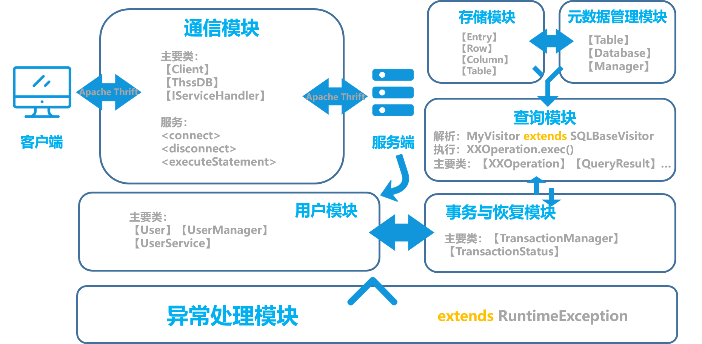

# 数据库大作业 设计文档


2017013570 黄    翔

2017013599 从业臻

2017013630 田丰源


## 概述

该文档为数据库大作业的设计文档，详细地阐述了各模块的设计与实现，以及整体的架构。

从模块划分上说，总共分为通信与用户模块、异常处理模块、存储模块、元数据管理模块、查询模块和事务与恢复模块。

### 实现要求

除了所有基础要求（不再一一列举）之外，实现了如下十项进阶要求：

1. 实现了**表的修改**（`ALTER TABLE`语句，支持`ADD/ALTER/DROP`）
2.  `where` 条件支持**任意层数的`and/or`逻辑运算符**（如 `(A or B) and (C or D)`）
3. 实现 **`outer join`等其他类型的`join`**，包括`笛卡尔积/natural join/left outer join/right outer join/full outer join`
4. 实现`select` 子句的**四则运算**（如`select 1+a, 3/b, c*2.0`），以及 **`DISTINCT/ALL`关键字**和 **`*/tableName.*`**
5. 实现**聚集函数**，包括`sum/avg/count/max/min`
6. 实现 **`order by`，支持多列排序以及`DESC/ASC`关键字**
7. 应用了简单的启发式**查询优化**：如果`where`条件形如`X [and Y]`，某个子式只涉及一张表，则在`join`之前先应用该子式条件；对于`equi-join`或`natural join`使用`indexed nested-loop join`方法提高效率
8. 实现了**三种隔离级别**，包括`READ UNCOMMITTED/READ COMMITTED/SERIALIZABLE`
9. 实现了 **多事务并发与恢复**，支持多个client同时操作，在不同隔离级别下有相应的正确行为
10. 实现了 **`rollback`和`savepoint`操作**，其中`rollback`可以指定回退到哪个`savepoint`

### 整体架构

整体架构基本按照大作业文档所划分的模块进行设计。

下图为部分类的粗略类图（主要涉及用户、存储和元数据管理模块，不包括查询与事务部分）：


下图为整体架构的图示：




## 通信与用户模块

### 概述

数据库系统整体采用客户-服务器模式（Client–server model），选用Apache Thrift作为服务端框架。

### 用户

#### 结构

为确保数据库系统的用户管理，配合`CREATE USER`等语句的实现，我们在通信模块的`connect`与`disconnect`结构基础上实现了较为完整的用户模块。
在`User`类中，定义了用户的基本信息，内含用户名、密码、权限等；在`UserManager`类中，定义了用户管理器，内含登录、注册、注销、查询的等接口；在`UserService`类中，定义了用户服务类，与在线用户一一对应，用于保存其服务信息，响应其服务请求。

#### 功能

* **用户登录**：通过`connect`服务，已注册用户可进行登录；
* **用户注册**：通过具有管理权限的账号调用`CREATE USER`语句，可以进行新用户的注册；
* **用户注销**：通过`disconnect`服务，已登录用户可退出登录；
* **用户验证**：通过`Session Id`的生成与分发，可进行用户的验证与识别；
* **信息管理**：可对用户的基本信息与部分操作信息进行管理与保存。


### 服务

#### `<connect>` 进行连接服务

##### 请求定义

``` thrift
struct ConnectReq{
  1: required string username
  2: required string password
}
```

##### 响应定义

``` thrift
struct ConnectResp{
  1: required Status status
  2: required i64 sessionId
  3: required string information
}
```

##### 服务功能

调用此服务，用户需传入用户名（`username`）与密码（`password`），系统将进行验证。对通过验证连接成功的用户，系统返回随机生成的`sessionId`，开放语句执行服务。

#### `<disconnect>` 断开连接服务

##### 请求定义

``` thrift
struct DisconnectReq{
  1: required i64 sessionId
}
```

##### 响应定义

``` thrift
struct DisconnectResp{
  1: required Status status
  2: required string information
}
```

#### 服务功能

调用此服务，系统将对用户进行验证。若其已在线，则将其下线。

#### `<executeStatement>` 执行语句服务

##### 请求定义

``` thrift
struct ExecuteStatementReq {
  1: required i64 sessionId
  2: required string statement
}
```

##### 响应定义

``` thrift
struct ExecuteStatementResp{
  1: required Status status
  2: required bool isAbort
  3: required bool hasResult
  4: required string information
  // only for query
  5: optional list<string> columnsList
  6: optional list<list<string>> rowList
}
```

##### 服务功能

调用此服务，用户需输入待执行性的`SQL`语句。若用户具有执行权限（并非是完整权限系统，只有`CREATE USER`需要管理员权限），数据库服务端将执行语句并返回相应结果。


## 异常处理模块

下表列出了所有异常类，均继承自`RuntimeException`：

| 类名                        | 描述                                                         |
| --------------------------- | ------------------------------------------------------------ |
| AlterColumnException        | 更改列异常                                                   |
| CalculationTypeException    | 计算类型错误（select子句的四则运算或聚集函数运算有类型错误） |
| CustomIOException           | IO过程出现错误                                               |
| DatabaseNotExistException   | 数据库不存在                                                 |
| DatabaseOccupiedException   | 数据库正在使用，无法删除                                     |
| DataFileNotFoundException   | 数据文件没有找到                                             |
| DuplicateDatabaseException  | 重复数据库                                                   |
| DuplicateKeyException       | 重复键                                                       |
| DuplicateTableException     | 重复表                                                       |
| DuplicateUserException      | 重复用户                                                     |
| IllegalTypeException        | 非法数据类型                                                 |
| KeyNotExistException        | 键不存在                                                     |
| MetaFileNotFoundException   | 元数据文件没有找到                                           |
| PermissionDeniedException   | 权限拒绝                                                     |
| SerializeException          | 序列化异常                                                   |
| TableNotExistException      | 表不存在                                                     |
| TableOccupiedException      | 表正在使用，无法删除                                         |
| UnknownColumnException      | 形如tableName.columnName/columnName的项中列名不存在          |
| UserNotExistException       | 用户不存在                                                   |
| WrongCreateTableException   | 表创建错误                                                   |
| WrongDataException          | 数据文件错误                                                 |
| WrongInsertException        | 插入错误                                                     |
| WrongMetaFormatException    | 元数据格式不正确                                             |
| WrongOrderByColumnException | 排序时列名不存在                                             |
| WrongPasswordException      | 错误密码                                                     |
| WrongTableNameException     | 查询时形如tableName.columnName的项中表名有误（未必是表不存在） |
| WrongUpdateException        | 更新错误                                                     |

此外，还有`ANTLR4`自带的`ParseCancellationException`处理所有的SQL解析异常，该异常会打印出出错的位置。


## 存储模块

### 概述

我们沿用了框架的存储结构（B+树类型数据结构`index`直接存储数据而非数据的位置）。

### 数据类型

数据库支持五种数据类型：`Int`，`Long`，`Float`，`Double`，`String`，用枚举类`ColumnType`中相应的常量标识，该类还提供了检查某一对象的枚举类型、枚举类型与字符串的相互转换、根据枚举类型获取对应的值等接口。框架中`Entry`类实现了五种数据类型的比较、判断相等、转化为`String`、获取哈希值等接口。

### 持久化与恢复

数据文件使用Java的序列化功能进行持久化，序列化的对象类型为`ArrayList<Row>`,值为`Table`的成员变量`index`的所有叶节点的`Row`，使用`TableIterator`获取。要从数据文件读取数据，只需要使用反序列化得到的`ArrayList<Row>`对象，反复调用B+树类的`put`函数即可（由元数据可以从`Row`中得到索引的值）。

`PersistentStorage`类中封装了序列化与反序列化功能。

当服务端启动时进行数据库数据的恢复；持久化则是在`CHECKPOINT`或一个数据库不再使用时进行（下文将会更详细地阐释）。

### 接口设计

以下均为`Table`类的重要接口。

#### insert
> 参数：待插入的行{Row}/待插入的行的字符串形式{String}
> 返回值：无
> 异常：DuplicateKeyException, IllegalArgumentException
> 实现：将待插入行的主键作为key，Row作为value调用B+树的void put(key,value)接口

#### delete

> 参数：待删除的行{Row}/待删除的行主键{Entry}/待删除行的主键的字符串类型值{String} 
> 返回值：无
> 异常：IllegalArgumentException
> 实现：将待删除行的主键作为key调用B+树的void remove(key)接口

#### update/updateNoRemove

> 参数：原有的行oldRow{Row}，新修改的行newRow{Row}
> 返回值：无
> 异常：DuplicateKeyException, IllegalArgumentException
> 实现：根据修改的内容是不是主键，调用不同的B+树接口（如果不是主键，这可以直接更改而不用先删后增）

####  updateAll
> 参数：要修改的列的索引idx{int}，新修改的值val{Comparable}
> 返回值：无
> 实现：用B+树的迭代器遍历叶节点，修改每个Row对象的idx处的值为val

#### search

> 参数：主键entry{Entry}
> 返回值：row{Row}
> 实现：以entry为key调用B+树的get(key)接口

####  drop
> 参数：无
> 返回值：无
> 实现：清空B+树索引，删除数据文件和元数据文件，删除表对应的文件夹

#### addColumn
> 参数：新加入列的名称{String}，类型{ColumnType}，最大长度{int}
> 返回值：无
> 实现：用传入的参数构造新的Column对象加入表的columns列表中，用表的迭代器遍历所有记录，为每条记录添加新的值为null的项

#### dropColumn
> 参数：要删除的列的名称{String}
> 返回值：无
> 异常：AlterColumnException，UnknownColumnException
> 实现：从表的columns列表中查找要删除的列，若该列为主键或不存在该列则抛出异常，否则从columns中删除该列，遍历表中记录删除对应项

#### alterColumn
> 参数：要修改的列的名称{String}，类型{ColumnType}，最大长度
> {int}
> 返回值：无
> 异常：AlterColumnException，UnknownColumnException
> 实现：从表的columns列表中查找要修改的列，若该列为主键或不存在该列则抛出异常，如果原列的类型与最大长度与传入的参数相同则直接返回，如果新旧列的类型不同且有一个是STRING则抛出异常（设定四种数字类型可以互相转换），否则更新columns中该列，遍历表中记录转换对应列的值的类型，中途如果字符串长度超过新修改的最大长度则恢复原columns并抛出异常。

#### persist
> 参数：无
> 返回值：无
> 异常：CustomIOException
> 实现：通过调用serialize()实现记录的序列化存储，调用persistMeta()存储元数据

#### recover
> 参数：rows{ArrayList(Row)}
> 返回值：无
> 异常：无
> 实现：参数为表中所有元组的列表，该接口以此为基础构建B+树，方法为对每个元组以主键为key，元组为value调用B+树的void put(key,value)接口


## 元数据管理模块

### 概述

我们将元数据管理单元提炼为一个类`Meta`，在`Table/Database/Manager/UserManager`类中都有一个`Meta`类的成员变量。

### 元数据文件格式

元数据文件采用文本形式。

首先，有一个包含所有数据库信息的元数据文件，包括：

* 所有数据库的名称

由于从数据库的名称就可以获取其元数据存储路径，故不需要另存路径。

数据库元数据文件目前包含

* 所有表的名称

由于从表的名称就可以获取其元数据和数据存储路径，故不需要另存路径。文件中每一行是一个表名，有多少表就有多少行。

使用这些路径可以读取数据库中表的元数据，其包含内容如下：

* 所属数据库名称
* 表名称
* 主索引编号
* 所有表结构原信息

文件中，前三行分别为数据库名称、表名称和主索引编号，之后每行都是一个字段的信息，该信息使用`Column`类的`toString`函数获得。

此外，我们还增添了一个管理用户数据的元数据文件，其包含

* 所有用户的用户名、密码


### 数据文件组织结构

>data文件夹
>
>> manager.meta (有哪些数据库)
>> user.meta (有哪些用户)
>> db1 (某个数据库的名字)
>>
>> > db1.meta (数据库里有哪些表)
>> > t1 (某个表的名字)
>> >
>> > > t1.meta (表的结构元数据)
>> > > t1.data (表的序列化数据)

### 持久化与恢复

当服务端启动时进行数据库元数据的恢复（而后根据元数据进行数据的恢复）；数据库、表级别的元数据（即有数据库里有哪些表，表的结构如何）的持久化在`CHECKPOINT`或一个数据库不再使用时进行；`Manager`级别和用户级别的元数据则是在新建、删除数据库、创建用户时立即进行持久化。

### 相关接口设计

以下列出了比较重要的接口。

#### Manager::createDatabaseIfNotExists

> 参数：name {String} 数据库名称
> 异常：DuplicateDatabaseException, CustomIOException
> 实现：查询哈希表databases，如不存在待创建同名数据库，则新建该数据库并记录于哈希表中；若已存在则抛出重复数据库异常。

#### Manager::deleteDatabase

> 参数：name {String} 数据库名称
> 异常：DatabaseNotExistException, CustomIOException
> 实现：查询哈希表databases，如存在待删除数据库，则删除该数据库并更新哈希表；否则抛出数据库不存在异常。

#### Manager::switchDatabase

> 参数：name {String} 数据库名称
> 异常：MetaFileNotFoundException, CustomIOException, DatabaseNotExistException
> 实现：读取与恢复新使用的数据库。

#### Manager::quitDatabase

> 参数：name {String} 数据库名称
> 异常：CustomIOException
> 实现：切换数据库或者断开连接时调用，若没有任何客户端使用某个数据库了，则会将其持久化

#### Database::create

> 参数：name {String} 表名称，columns {Column[]} 列定义，primaryIndex {int} 主键索引
> 异常：DuplicateTableException
> 实现：查询哈希表tables，若不存在待添加同名表，则新建该表，并记录于哈希表中；若已存在则抛出重复表异常。

#### Database::drop

> 参数：name {String} 表名称
> 异常：TableNotExistException, CustomIOException
> 实现：查询哈希表tables，如存在待删除表，则删除该表并更新哈希表；否则抛出表不存在异常。

#### Database::recover

> 参数：无
> 异常：WrongMetaFormatException, MetaFileNotFoundException, CustomIOException, ClassNotFoundException 主要是文件读取/反序列化相关异常
> 实现：从数据库的元数据文件初始化表，并将表数据加载到内存

#### Database::persist

> 参数：无
> 异常：DataFileNotFoundException, CustomIOException
> 实现：持久化数据库元数据/表元数据/表数据


## 查询模块

### 概述

总体流程为：

1. 借助`Antlr4`生成SQL语句的语法树；
2. 使用Visitor模式解析语法树，将中间组件（如`where`后面的逻辑表达式）封装成相应`Item`类，根据不同的操作生成相应的`Operation`类；
3. 最后调用`Operation`类的`exec`方法完成语句的执行。

### SQL解析

#### 实现

1. 根据实现的语法对`SQL.g4`文件的`select_stmt`进行修改，添加了`outer join`, `order by`等语法；
2. 使用`Antlr4`的Visitor模式，编写`MyVisitor`类, `MyErrorListener`类，分别继承`SQLBaseVisitor`类和`BaseErrorListener`类：
   * `MyVisitor`：重载`SQLBaseVisitor`中与实现功能相关的`visit`方法，将传入的SQL语句逐层解析（其中中间组件被封装成`Item`类），最终转化为`Operation`包下的类并返回；
   * `MyErrorListener`：重载`BaseErrorListener`的`syntaxError`方法，用于检测语法错误并抛出异常。

#### `select`语句解析过程

`select`语句的解析分为四部分，分别是`select`部分、`from`部分、`where`部分和`order by`部分。

* `select`部分将返回一个`SelectContentItem`类，这个类包含是否`DISTINCT`的标记，以及一个`SelectItem`数组。`SelectItem`即是所有select的内容，包括运算式、聚集函数等；

* `from`部分返回一个`FromItem`类，包含连接的一张或两张表、连接类型和条件（如有）；

* `where`部分返回一个表达式树`MultipleConditionItem`类，每个叶节点是一个原子表达式（不含`and/or`），非叶节点是`and/or`。表达式由`ConditionItem`封装；

* `order by`部分返回`OrderByItem`，包含排序类型和排序依据的字段。


#### 其他语句解析过程

其他语句的语法较为简单，解析过程不再赘述。其中，增删改语句的`where`部分解析与`select`相同。 


### 语句执行

#### 实现

SQL语句的执行通过调用各`Operation`类的`exec`方法实现，`exec`方法对数据类型等约束进行检查并抛出相应的异常，调用存储模块、元数据模块等模块的接口对数据库进行操作，返回执行结果。此外，`Operation`类还需要得到发起SQL命令的用户信息以及该用户使用的数据库，这部分由通讯模块和用户管理模块负责。

#### select语句执行过程

`select`语句执行过程分为六部分。

1. 根据`FromItem`，从数据库中获取相应的表，并初始化记录元数据的变量，为后续的列索引计算等服务；
2. 基于数据库中获取的表，根据连接类型，得到一个`Row`类型迭代器（这里是应用了查询优化，如果有只涉及一张表的`where`条件，则这个迭代器是该表满足该条件的行组成的）。这部分封装在`QueryTable`类中。这一步得到的行迭代器返回的已经是合并后的行，之后的下标计算也是根据这个新行进行；
3. 使用第二步得到的行迭代器，遍历所有行（或者使用`indexed nested-loop join`），判断每个行是否满足`MultipleConditionItem`的条件以及`join`类型的约束条件。
4. 对筛选后的行列表进行排序（如有）。
5. 根据`SelectContentItem`对Row列表进行选择与运算。
6. 如有需要，对结果进行去重。

在以上过程中，随时可能抛出异常。

#### 条件判断

`where`子句所蕴含的条件使用一棵二叉树表示，叶节点为单一条件，非叶节点为`and/or`。要判断一个`row`是否满足条件，先从树根将`row`自上而下地传递到每个叶节点，求出布尔值，再自下而上地求得整棵树的布尔值。

#### select子项的四则运算与聚集函数计算

对于每个`select`子项，解析语法树时都会记录其类型（形如`X, X+1, 1+X, 1+1, aggrFunc(X)`），之后根据相应的类型，以及`X`本身的数据类型进行值的运算和查询结果标题的生成。

#### 查询优化

我们应用了两项简单的启发式查询优化：
1. “先选择”，即对于涉及两个表的操作，如果`where`条件形如`X [and Y]`，其中有只涉及一个表的子式，那么在`join`之前先应用该子式条件，提高查询效率；
2. 尽可能使用`indexed nest-looped join`，若两个表`join`的条件为`x.x=x.x`（或者是`natural join`），且等式一边是一个表（记为A）的主键，那么用`indexed nest-looped join`代替两表的循环遍历。具体地说，可以只遍历非A的表，对每一行，只需要在A表中按主键搜索唯一满足条件的行即可。

#### 增删改语句执行过程
`insert`语句执行时首先进行属性名、数据类型等的检查，如果不满足约束则抛出异常，否则调用`Table`的`insert`接口插入数据，如果在插入的过程中造成了主键的重复则删除这次操作中已经插入的元组并抛出异常。
`delete`语句执行时如果没有`where`子句则直接调用`Table`的`delete`接口删除所有元组，有`where`子句则遍历所有元组，判断元组是否满足`where`条件，满足则调用`Table`的`delete`接口删除。
`update`语句执行时首先进行属性名、数据类型等的检查，如果不满足约束则抛出异常，之后如果没有`where`子句则直接调用`Table`的`updateAll`接口进行修改，否则遍历所有元组，判断是否满足条件，满足则修改。在更新过程中如果造成了主键的重复，则将表恢复更新前的内容并抛出异常。

#### 其他语句执行过程

`create/drop/use database`, `create/drop/show/alter table`,`create user`等语句的执行较为简单，在对解析得到的数据结构进行检查后，调用表、数据库等类的接口执行相应操作。

### 接口设计

注：各`Operation`类均继承自`BaseOperation`,`Operation`类的`exec`方法用到的数据均在构造该类时传入并赋值给成员变量，因此`exec`方法参数为空；此外，如果执行时抛出异常，则会被上层捕获，故不需要返回一个表示状态的变量。以下列出了一些Operation类的`exec`接口描述：

#### AlertTableOperation.exec()
> 异常：DatabaseNotExistException，TableNotExistException
> 实现：判断数据库和表是否存在，存在则根据命令类型(添加/修改/删除)调用Table的相应接口(addColumn/dropColumn/alterColumn)，否则抛出异常

#### CreateDatabaseOperation.exec()

> 异常：DuplicateDatabaseException, CustomIOException
> 实现：调用Manager类的createDatabaseIfNotExists()创建数据库

#### CreateTableOperation.exec()

> 异常：DatabaseNotExistException, DuplicateTableException, WrongCreateTableException, CustomIOException
> 实现：首先对主键进行检查，如果未设置主键/主键不唯一/列名重复则抛出异常，否则调用Database的create方法创建表

#### CreateUserOperation.exec()

> 异常：PermissionDeniedException, DuplicateUserException
> 实现：调用UserManager的logon方法创建用户

#### DeleteOperation.exec()

> 异常：DatabaseNotExistException，TableNotExistException
> 实现：判断数据库和表是否存在，存在则根据where条件（如有）删除相应数据，否则抛出异常

#### DropDatabaseOperation.exec()

> 异常：DatabaseNotExistException
> 实现：调用Manager类的deleteDatabase方法删除数据库

#### DropTableOperation.exec()

> 异常：DatabaseNotExistException, TableNotExistException
> 实现：数据库不存在则抛出异常，否则调用Database类的drop方法删除表

#### InsertOperation.exec()

> 异常：DatabaseNotExistException，TableNotExistException，WrongInsertException
> 实现：判断数据库和表是否存在，不存在则抛出异常，否则对数据类型等进行检查，存在问题则抛出异常，否则调用Table的insert方法插入行

#### SelectOperation.exec()

> 异常：DatabaseNotExistException，TableNotExistException, UnknownColumnException, CalculationTypeException, WrongOrderByColumnException
> 实现：判断表是否存在，不存在则抛出异常，否则对数据类型等进行检查，存在问题则抛出异常，否则按照上述“select语句执行过程”得到查询结果并返回

#### ShowOperation.exec()

> 异常：DatabaseNotExistException，TableNotExistException
> 实现：如果数据库和表存在则将表的元数据以一定的格式返回，否则抛出异常

#### UpdateOperation.exec()

> 异常：DatabaseNotExistException，TableNotExistException，WrongUpdateException
> 实现：判断数据库和表是否存在，不存在则抛出异常，否则对数据类型等进行检查，存在问题则抛出异常，否则调用Table的update方法插入行

#### UseOperation.exec()

> 异常：CustomIOException, DatabaseNotExistException, MetaFileNotFoundException
> 实现：调用Manager的quitDatabase和switchDatabase方法切换数据库


## 事务与恢复模块

### 事务部分

#### 整体实现

我们的查询部分将各类SQL操作封装为了各个`Operation`类。其中，部分`Operation`如创建用户,对事务毫无影响；部分`Operation`如切换数据库，虽不算是事务，却应该先将目前的事务强制`COMMIT`(如有)；剩余事务都直接牵涉到事务机制。

因此，我们建立了`TransactionManager`类，集中管理各类与事务有关的`Operation`的执行。在这个类中，我们进行并发控制和日志维护。

在服务端，每个在线用户拥有一个属于自己的线程，以及一个`UserService`类实例负责对用户操作进行响应。在每个`UserService`类里就会有一个`TransactionManager`类实例负责处理该用户的事务。

#### 接口设计

* **执行**：执行一个操作，返回状态（包括成功与否、错误信息（如有）、查询结果（如有））

```java
public TransactionStatus exec(BaseOperation operation)
```

* **设置环境**：设置当前正在使用的数据库

```java
public void setDatabase(String databaseName)
```

`exec`函数实际上是一个进行“分流”的外部接口。根据operation类型的不同，该函数将operation交给TransactionManager类内部不同函数处理，包括：

```java
private TransactionStatus beginTransaction()
private TransactionStatus readTransaction(BaseOperation operation)
private TransactionStatus writeTransaction(BaseOperation operation)
private TransactionStatus commitTransaction()
private TransactionStatus rollbackTransaction(String savepoint)
...
```

尽管绝大多数操作本身的内容只需要调用`operation.exec()`，不同类型的操作在加锁、日志维护等方面却大有不同。具体来说：

* **beginTransaction** 对应于`begin transaction`语句，标记了事务的开始，如果此时已有事务进行，则报错；
* **readTransaction** 对应于`select`语句，需要加读锁；
* **writeTransaction** 对应`insert`/`delete`/`update`语句，需要加写锁，将该操作压入操作链表；
* **commitTransaction** 对应`commit`语句，需要释放锁，遍历操作链表并写日志，再清空操作栈，标记事务结束；
* **rollbackTransaction** 对应`rollback`语句，根据`savepoint`（如有），从操作链表一个个弹出操作并进行“反操作”，并一个个释放锁；
* **savepointTransaction** 对应`savepoint`语句，将当前操作链表大小对应到检查点名称；
* **checkpointTransaction** 对应`checkpoint`语句，将日志清空，持久化当前数据库的所有修改过的表；
* **endTransaction** 对应大多数其他语句，如果当前有正在进行的事务，则自动将其强制`commit`，再执行自身

### 并发控制部分

#### 整体实现

数据库系统参考HSQLDB的默认并发控制机制，基于表级可重入读写锁共实现了三级不同的封锁协议，其相关特性整理如下：

| 封锁协议 | 隔离级别           | 丢失更新 | 肮读 | 不可重复读 | 虚读 |
| -------- | ------------------ | -------- | ---- | ---------- | ---- |
| 一级     | `READ_UNCOMMITTED` | 否       | 是   | 是         | 是   |
| 二级     | `READ_COMMITTED`   | 否       | 否   | 是         | 是   |
| 三级     | `SERIALIZABLE`     | 否       | 否   | 否         | 否   |

其相关实现思路整理如下：

* **一级**：事务在对表执行写操作之前需获取其写锁（X锁），事务完毕后才释放。
* **二级**：事务在对表执行写操作之前需获取其写锁（X锁），事务完毕后才释放；事务在对表执行读操作之前需获取其读锁（S锁），操作完毕后即可释放。
* **三级**：事务在对表执行写操作之前需获取其写锁（X锁），事务完毕后才释放；事务在对表执行读操作之前需获取其读锁（S锁），事务完毕后才释放。

#### 接口设计

在`TransactionManager`类，事务操作中`SQL`语句解析出的`operation`对象将在此处被组织与执行。其中的锁操作相关接口进行了不同线程事务间的隔离。锁操作相关接口设计如下：

* **获取读锁**：获取特定表读锁，并记录

```java
private boolean getTransactionReadLock(String tableName)
```

* **获取写锁**：获取特定表写锁，并记录

```java
private boolean getTransactionWriteLock(String tableName)
```

* **释放读锁**：释放记录中特定表读锁

```java
private boolean releaseTransactionReadLock(String tableName)
```

* **释放写锁**：释放记录中特定表写锁

```java
private boolean releaseTransactionWriteLock(String tableName)
```

* **释放读写锁**：释放记录中所有读写锁

```java
private void releaseTransactionReadWriteLock()
```

### 恢复部分

#### 实现

恢复机制的实现采用了WAL技术，并且很大程度地参考了`HSQLDB`。如上文事务机制部分所述，`TransactionManager`维护了一个操作链表，这个起到了内存中的日志作用。在`commit`的时候，会根据操作链表中的内容以一定的格式写入外存日志（需要将`delete`/`update`拆成原子操作）；在`checkpoint`的时候，会将当前数据库修改过的表持久化，并清空外存日志。以上基本与HSQLDB一致。日志的格式如下：

```
INSERT <TABLENAME> <ROW.TOSTRING()>
DELETE <TABLENAME> <PRIMARY_ENTRY_VALUE>
COMMIT
CREATE TABLE ...(标准语法)
DROP TABLE <TABLENAME>
ALTER TABLE ...(标准语法)
```

服务端启动并恢复时，即一条条执行日志中的记录。`insert`/`delete`的记录比较简单，节省解析时间，且可以开销更小的完成恢复操作；`create table`/`drop table`/`alter table`则调用SQL解析功能处理。

这里参考`HSQLDB`，对表本身的增删改需要写入日志，而增删改的时候并不立即持久化——若是立即持久化了，从日志恢复时可能会有问题（比如先向一个表插入数据，再删除表，那么恢复时则是向一个不存在的表插入数据）。

此外，服务端会维护一个数据结构，记录所有的数据库的使用计数（有几个客户端正在使用）。客户端断开与服务端连接时，或者切换数据库时，服务端会将之前使用的数据库的计数减1。当一个数据库计数为0时，就会自动调用`checkpoint`操作，将写前日志清空，持久化该数据库。

#### 接口设计

* **数据库级别的从日志恢复**: 读取日志并一条条执行

```java
public void logRecover()
```

接下来的三个函数属于`Logger`类，用于管理日志文件单纯的读写。

* **日志文件读取函数**

```java
public ArrayList<String> readLog()
```

* **日志文件写入函数**

```java
public void writeLines(List<String> lines)
```

* **日志文件清空函数**

```java
public void eraseFile()
```

## 测试

对存储模块、元数据模块、查询模块中的SQL解析，测试位于`src/test`文件夹，使用`junit`进行自动化测试。

对查询模块中的功能实现部分，测试主要位于`main/java/cn/edu/thssdb/client/TestClient.java`中，采用自动化+人工结合的方式测试。

对于事务模块的并发部分与恢复部分，采用人工检查的方式测试。


## 任务分工

| 模块           | 主要负责人     |
| -------------- | -------------- |
| 通讯与用户模块 | 黄翔           |
| 存储模块       | 田丰源         |
| 元数据管理模块 | 田丰源、从业臻 |
| 查询模块       | 从业臻、田丰源 |
| 事务与恢复模块 | 黄翔、从业臻   |


## 感谢与感想

* **黄翔：** 在本次项目中，基于给定的代码框架，我们实现了一个结构完整、功能正确的迷你版数据库，包括通讯与用户、存储、元数据管理、查询、事务与恢复等模块。在项目的开发过程中，团队协作能力、代码开发能力得到了较好的锻炼，课程中所学的理论知识得到了充分的实践。同时，在此疫情影响下的特殊网络学期，我们的大作业从协作设计、并行开发，到文档撰写、验收答辩，都遇到了不同于以往的特殊挑战。所幸，在老师、助教的帮助下，在队友的齐心协力下，我们最终克服了困难，进一步历练了发现问题、解决问题的能力。最后，在此次项目中，基本要求定义得较为简单基础，而进阶要求设置得不够明确合理。建议在今后的大作业设置中，能适当地提高基础要求，充分地阐明进阶要求，以砥砺后续参与此课程的同学，让更多人能够更好地从项目实践中受益。

* **田丰源：** 通过写大作业巩固了课上学过的内容，加深了对理论的理解，锻炼了开发能力，增进了交流，收获很大。希望以后的大作业能增加小组人数，适当提高要求，做出更好的成果。感谢老师和助教的指导与帮助。

* **从业臻：** 本次大作业堪称重量级，无论代码量还是所花时间大约都只有软工可与之相提并论，相应地，收获也是相当多。其一，熟悉了一门新语言java，挺喜欢java的；其二，再次锻炼了几人合力开发的能力，从商讨架构设计、实现功能，到具体的分工协作，我们开了无数腾讯会议，github仓库也commit了近200次；其三，也是最为重要的，把数据库课程的理论知识实打实地应用到了这个项目中，真切地体会了设计上的各种考虑，权衡了不同方案的优缺点。在我看来，项目提供的框架特别友好，助我们很快地上手，也解决了棘手的B+树（数据结构与算法）和Antlr解析（编译原理），让我们可以专注于数据库这门课的核心内容，也留足了自主设计的空间。因此，这次大作业体验还是很棒的，十分感谢老师和助教的悉心准备与答疑。